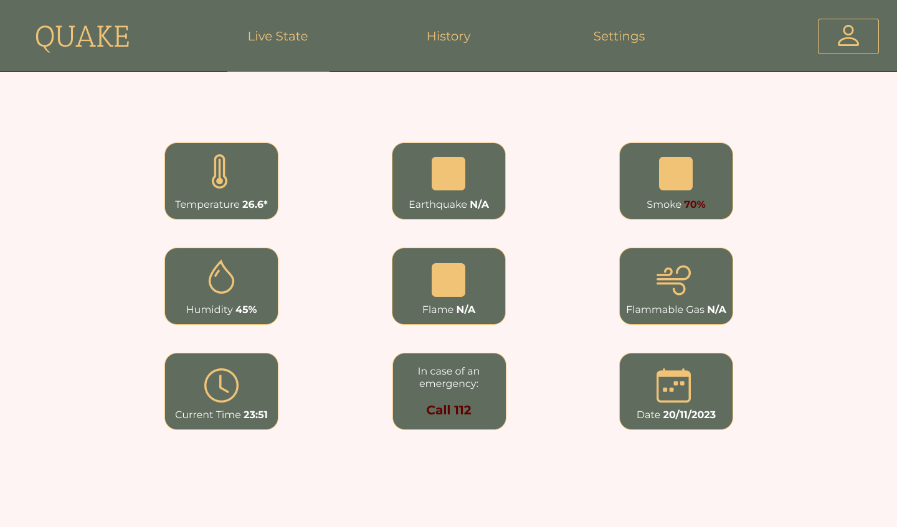

# Quake - Security by Design Project

**Module 5, Bachelor of Technical Computer Science, University of Twente**

**Date:** 08-11-2023

## Overview

The "Quake" project is an alarm system developed using a Raspberry Pi. It integrates various sensors to provide comprehensive real-time monitoring and alerts for potential threats such as earthquakes, fires, and gas leaks.

**Check out the demo presentation of the alarm on [YouTube](https://youtu.be/jGW5Ft2ZPW8).**

## Purpose

The "Quake" project is designed to offer a robust solution for:

1. **Integration of Fire Alarm and Earthquake Detection**: Seamlessly combines fire alarm mechanisms with earthquake detection tools to provide real-time threat monitoring and advanced warnings.

2. **Immediate Visual and Audio Alerts**: Features an integrated speaker and LED to trigger immediate visual and audio alerts during emergencies, ensuring users are promptly informed even if they don't notice the hazard immediately.

3. **Real-Time Environmental Data**: Displays current temperature, humidity, and seismic wave information. Specifically, it monitors the accelerometer’s current acceleration, useful for earthquake detection when properly configured.

4. **Protection Against Multiple Threats**: Aims to deliver protection against gas leaks, fires, and earthquakes, reflecting the system's versatility and adaptability in critical situations.

## How to Build and Run
1. Setup a virtual python environment.
2. Install the necessary dependencies via `pip install -r requirements.txt`.
3. Change the current directory to where the startup file is located via `cd app`.
4. Run the flask server via `python app.py`.

## System Limitations

While "Quake" offers significant functionality, there are a few limitations to consider:

1. **Maintenance and Software Updates:** Regular updates and maintenance are crucial to ensure system accuracy and reliability. Neglecting these may lead to vulnerabilities or inefficiencies.

2. **Hardware Limitations (Sensors):** The system's performance depends on the quality of the sensors. Given unlimited resources, high-end sensors like the Raspberry Shake could have been used for enhanced robustness.

3. **Constant Energy Source Required:** The system is designed for stationary use and requires a continuous connection to a reliable power source.

## Project Details

This project uses a Raspberry Pi equipped with various sensors (accelerometer, humidity, temperature, and gas detection). It hosts a Flask server that provides a dashboard for monitoring sensor data and adjusting alarm settings. My role involved managing communication between the Raspberry Pi and sensors, as well as handling data transmission and processing within the local database.

## Team Credits

This project would not have been possible without the contributions of my teammates:

- [Alexandru Verhovetchi](https://github.com/Alex-Verh)
- [Dimitris Kalopisis]()
- [Michalis Flevaris]()

